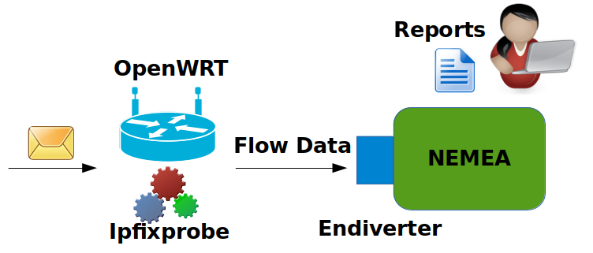

# Nemea OpenWrt feed

## Description

This is an OpenWrt package feed containing NEMEA system components for exporting flow data.



The figure above shows OpenWRT router with running NEMEA flow exporter [flow_meter](https://github.com/CESNET/Nemea-Modules/tree/master/flow_meter).
Since OpenWRT routers usually use big-endian architecture, it is necessary to use a special module [endiverter](https://github.com/CESNET/Nemea-Modules/tree/master/endiverter) that converts values of UniRec fields to the byte-order that is used on x86 architecture.
Due to performace reasons, this conversion is not done automatically in libtrap nor UniRec.

## Usage

To use these packages, add the following line to the feeds.conf
in the OpenWrt buildroot:

```
src-git nemea https://github.com/CESNET/Nemea-OpenWRT
```

To install package definitions, run:

```
./scripts/feeds update nemea
./scripts/feeds install -a -p nemea
```

The nemea packages should now appear in menuconfig.
